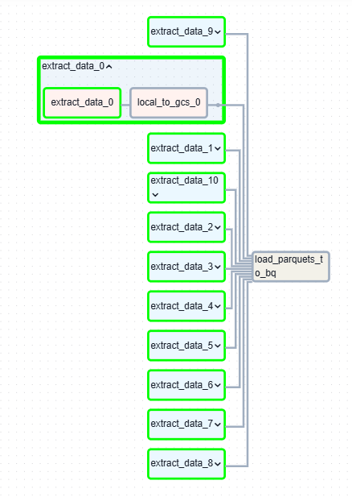
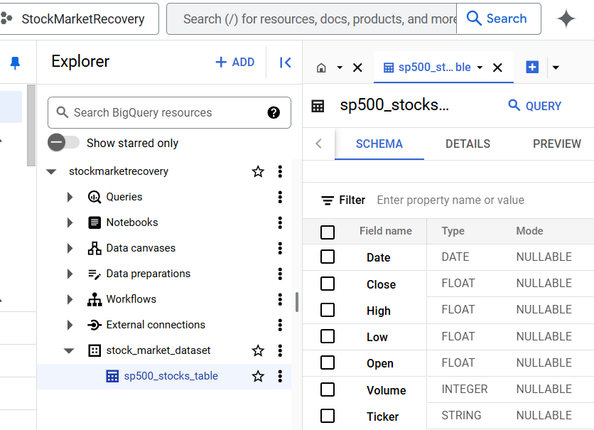
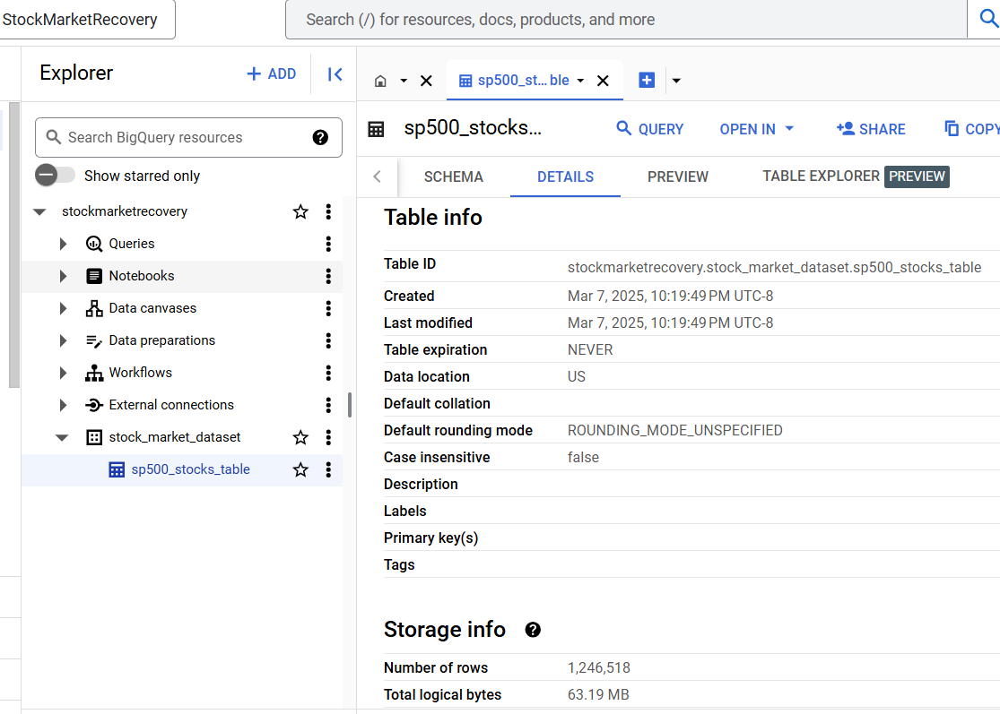
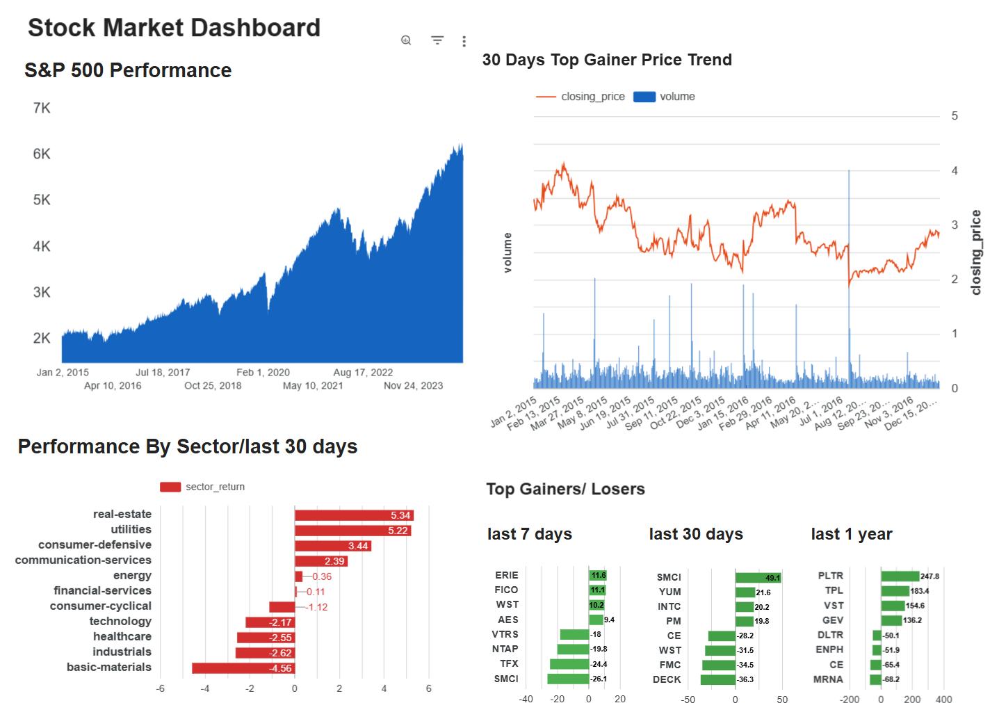

# Stock Market Insights

## Table of Content

- [Overview](#overview)
- [Architecture and Technologies](#architecture-and-technologies)
- [ETL Data Pipeline](#etl-data-pipeline)
	 - [Extract and load data](#extract-and-load-data)
	 - [Data Transformation](#data-transformation)
	 - [Dashboard/Visualization](#dashboard-visualization)
- [Reproducing this repo](#reproducing-this-repo)


## Overview
- This data engineering project focused on batch processing data to provide investors with stock market insights.
### project goal
- The project monitors S&P 500 stocks performance (like Apple, Amazon, Google, Nvidia, Microsoft) over time to help investors make informed investment decisions. \
	✅ Collect daily stock prices of all the S&P 500 stocks for the last 10 years.\
	✅ Compute price change/returns for the last 7 days, 30 days, and 1 year, and sector-wise performance.\
	✅ Visualize key factors such as price trends, sector performance, and top gainers and losers via the Google Looker Studio dashboard.\
	✅ Update data and a Google Looker Studio dashboard daily using batch processing.

### Problem description 
- Some of the questions answered:\
"How's the S&P 500 performance for the last 10 years?"\
"Which sector performed best for the last 30 days?"\
"Which stocks had the highest return for the last 7 days, the last 30 days and the last 1 year?"\
"Which stocks had the lowest return for the last 7 days, the last 30 days and the last 1 year?"\
"What are the Top-Performing & Worst-Performing Stocks?"\
"How's the historical trends of the top gainer"

## Architecture and Technologies
### Architecture
- 

### The Technologies used:
- Cloud: Google Cloud Platform(GCP)
- Container: Docker, Docker Compose
- Infrastructure as code (IaC): Terraform
- Workflow orchestration: Airflow
- Storage / DataLake: Google Cloud Storage(GCS)
- Data Warehouse: BigQuery
- Batch processing: Python
- Transformation/Data Modeling: dbt
- Dashboard/ Data Visualization: Google Looker Studio

How does this end-to-end pipeline work?


## ETL Data Pipeline
### Extract and Load Data
- Data sources:
  - Raw S&P 500 stocks data: Get historical data from Yahoo Finance API via yfinance package.
  - Reference table (sp500_stocks_info.csv) for stock company information.
- DAG graph:
  

- After ETL Pipeline, Data in BigQuery:
   \
  

### Data Transformation
A standard dbt project (__dbt-SQL-Transformation__) focuses on transforming and modeling raw data into analytics-ready tables, i.e. defining clear layers of transformations that clean, aggregate, and structure stock market data for analytics and reporting.
#### Design the dbt Models
dbt project Structure: dbt follows a staging → intermediate → marts structure.
```
stock_analysis/
│── models/
│   │── staging/
│   │   ├── stg_sp500_stockdata.sql
│   │── intermediate/
│   │   ├── int_7d_returns.sql
│   │   ├── int_30d_returns.sql
│   │   ├── int_1y_returns.sql
│   │   ├── int_3y_returns.sql
│   │   ├── int_ytd_returns.sql
│   │   ├── int_yearly_returns.sql
│   │── marts/
│   │   ├── mart_sector_performance_30d.sql
│   │   ├── mart_7d_tops.sql
│   │   ├── mart_30d_tops.sql
│   │   ├── mart_1y_tops.sql
│   │   ├── mart_sp500_performance_trend.sql
│   │   ├── mart_30d_top_price_trend.sql
│── dbt_project.yml
│── packages.yml
│── seeds/
│   ├── sp500_stocks_info
│── snapshots/
│── tests/
│── macros/

```
staging/ → Ceans and standardizes raw data (1:1 with source tables).\
intermediate/ → Derived tables for calculations (e.g., returns, price change).\
marts/ → Final analytics tables for reporting.\
seeds/ → Static reference data (e.g., stocks info).\
tests/ → Data quality tests (e.g., null checks, uniqueness). Ensure data quality with tests.

#### 1. Staging Layer (stg_*) - Cleans and standardizes raw data.
- Load raw data into staging tables, ensuring clean and structured formats.
- Normalization: \
	This layer removes duplicates, renames columns, fill in missing values, and standardizes data types to ensure the data format matches your target schema. Ensures one row per stock per day.

#### 2. Intermediate Layer (int_*) - Transformations: Performs calculations and aggregations.
Create aggregated or derived calculations such as moving averages, stock returns, volatility, etc.
Derived Tables: used to feed into final reporting tables.

e.g. 
Fact Table: monthly_returns stores precomputed results for performance analysis.
Granularity: Monthly-level summary.
Optimization: Improves dashboard performance.


| Table Name | Purpose |
|------------|----------|
| int_stock_returns | Calculates daily, weekly, and monthly returns.|
| int_moving_averages | Computes 30-day and 90-day moving averages. |
| int_sector_performance | Aggregates stock performance by sector. |
| int_volatility | Measures stock volatility (standard deviation of returns). |
| int_news_impact | Computes sentiment scores for stock movements. |

Table: stock_performance_fact (Granularity: Monthly)

Tracks historical stock performance over time.
Easy to calculate daily returns, volatility, moving averages, etc.
Supports slicing by date, company, sector, or exchange.


#### 3. Marts Layer (dim_* and fact_*) - Analytics: Provides final tables for dashboarding. 
Goal: Create Fact & Dimension tables for business insights.
Star Schema → Fact Tables & Dimension Tables.
	Fact tables: Contain numerical values for analytics. (aggregated fact table)
	Dimension tables: Contain descriptive information.
| Table Name | Purpose |
|------------|----------|
| fact_stock_prices |	Main table with price, volume, returns, and moving averages. |
| fact_trading_activity |	Aggregated trading volume and order flow. |
| fact_news_sentiment |	Sentiment trends over time for stocks. |
| dim_stock_metadata | Stock details (company name, sector, industry). |
| dim_dates	| Date dimension for time-based filtering. |
	


### Dashboard/Visualization


or  https://lookerstudio.google.com/reporting/94fbb36f-a6a8-406d-aa0a-4b3a19084a29 

1. Overall Market Trends 
Line Chart: Tracks the S&P 500 index trends over 10 years.
2. Sector-wise Performance
Bar Chart: Shows percentage gains/losses per sector for the last 30 days.
3. Top Gainer Stock Price Trend
Line Chart: Tracks 30-day-top-gainer stock price trends for 10 years.
4. Top gainers/losers
Bar Chart: Shows Top gainers and losers for the last 7 days, 30 days, and 1 year.


## Reproducing this repo
1. git clone 
2. Environment setup
  - Set up Terraform, GCP account and SDK \
    Local install and setup terraform: \
    GCP account setup: Apply a GCP account, try free trial, new project and copy project ID. \
    Download and install SDK (Google Cloud CLI). and run commands below to authorizing gcloud CLI access Google Cloud.\
       ```
       #Git Bash shell
       gcloud init
       gcloud auth application-default login   #After this, $GOOGLE_APPLICATION_CREDENTIALS was set to google cloud account default credential.json. Which is different from Service Account credential.
       ``` 
    Set Service Account for this project: GCP console >menu>IAM & Admin> Service Accounts -> Create service account ---> once created, click three dots at the right>Manage Keys>json> save the downloaded serviceaccount_credential.json file.
    
  - Set up Cloud Infrastructure(Bucket and dataset) via terraform
    Edit terraform/variables.tf and run commands below.
    ```
    #Git Bash shell      
    cd 1_terraform-gcp/terraform
    terraform init
    terraform plan
    terraform apply
    terraform destroy 
    ```
3. EL pipeline via airflow  

- Environment setup 
  ```
  #Git Bash shell  
  mv $HOME/Downloads/<YOUR SERVICE ACCOUNT KEY>.json ~/.google/credentials/google_credentials.json
  ```
  Edit docker-compose.yaml: GCP_PROJECT_ID

- Build and run custom airflow container
    ```
    #Git Bash shell      
    cd airflow
    docker-compose build    (it takes 10 mins for the first time)
    docker-compose up airflow-init
    docker-compose up -d

    docker-compose down   
    ```
- Check or manually run Dag/pipeline in Browser: localhost:8080    airflow/airflow \
  Two DAGs: stocksdata_gcs_bq_dag - Extrat stock data for 10 years. \
  		_dag - Scheduled daily, and extract today's stock data at the end of a day.
  

4. dbt Transformation
   ```
   dbt 
   ```


## Further work
(all the tickers whose stock price is under 200 dollars )
stock recommendation model
